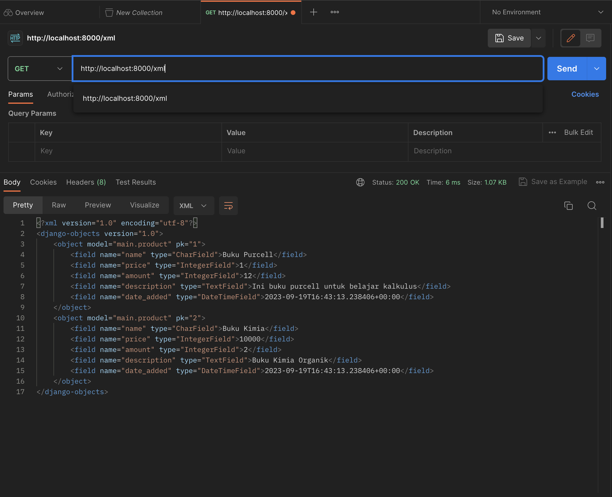
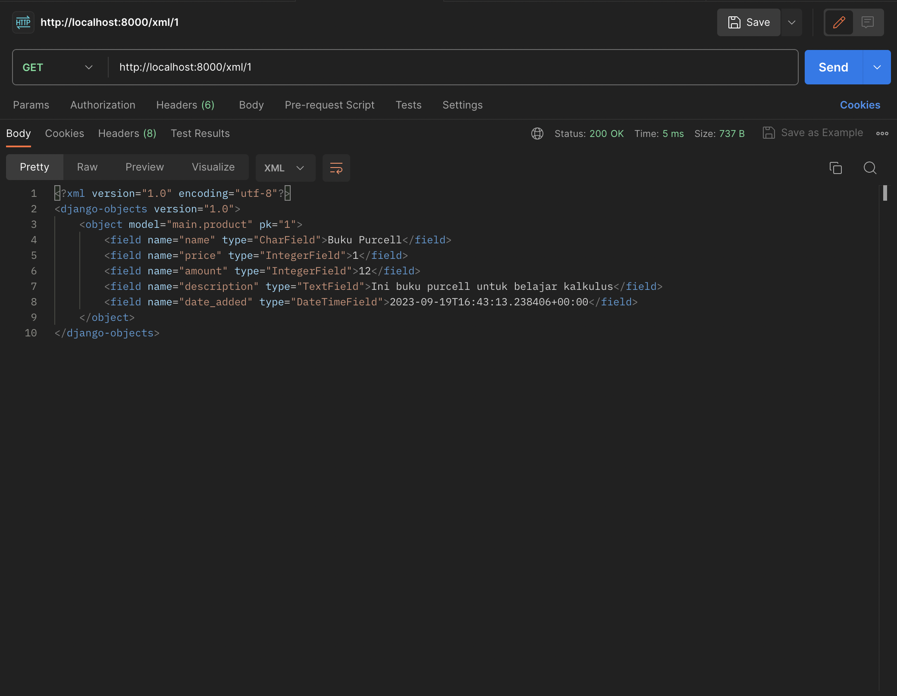
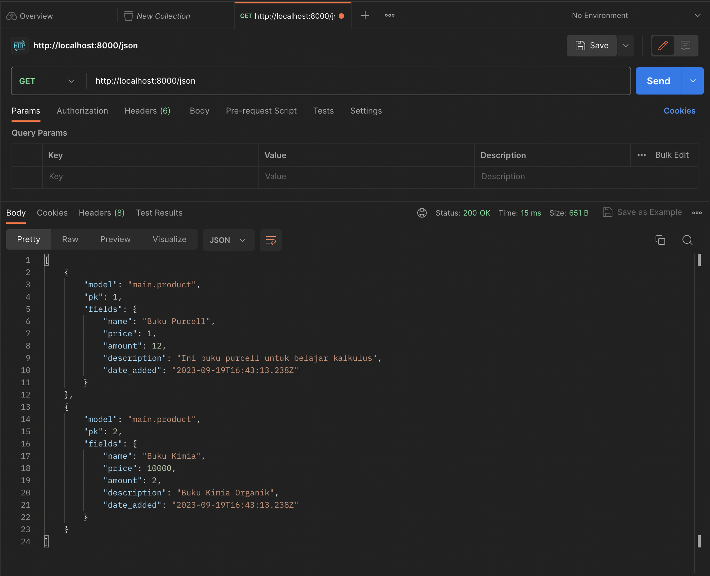
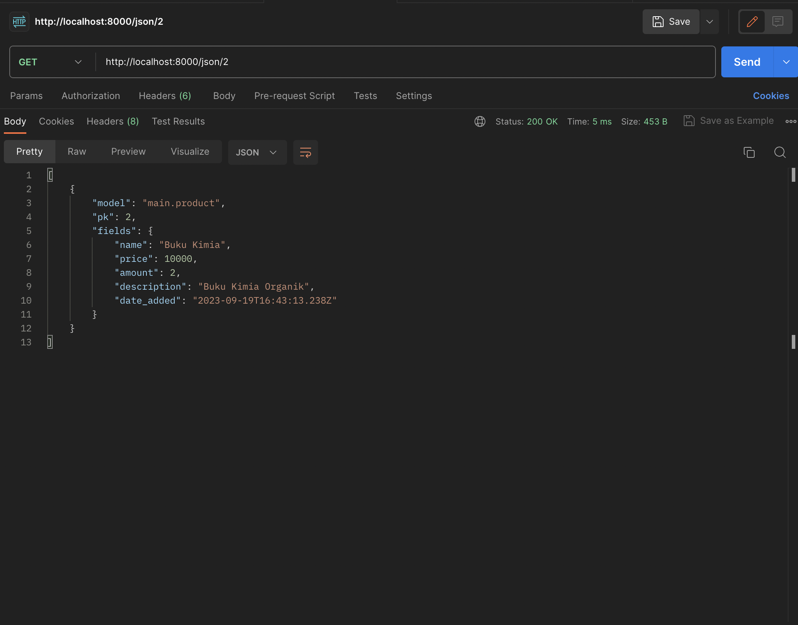
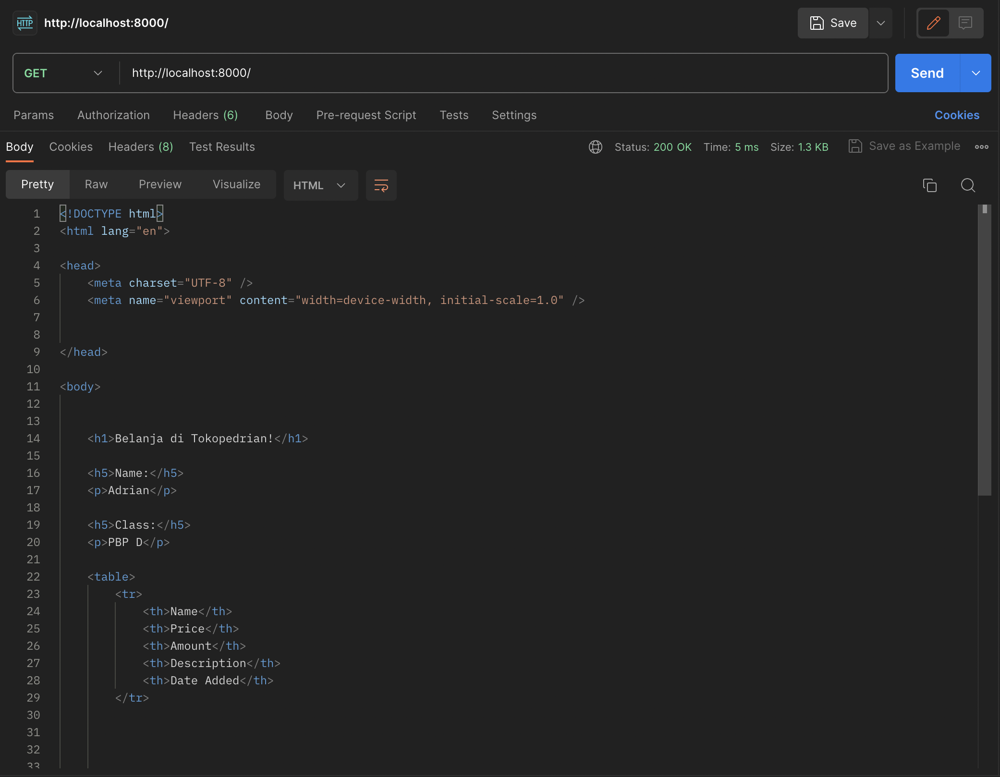

# :shopping_cart: Tokopedrian :shopping: :green_book:
`Tiga pilot bawa durian, kalau shopping di Tokopedrian!`

## Tugas Individu 4.
>1. Jelaskan bagaimana cara kamu mengimplementasikan checklist di atas secara step-by-step (bukan hanya sekadar mengikuti tutorial).

- [x] Mengimplementasikan fungsi registrasi, login, dan logout untuk memungkinkan pengguna untuk mengakses aplikasi sebelumnya dengan lancar.
Pada `views.py`, saya membuat fungsi `register(request)`, `login(request)`, `logout(request)`  untuk melakukan registrasi, login, dan logout.  Untuk fungsi `logout`, saya menghapus cookie setelah melaksanakan logout. Untuk fungsi registrasi dan login, saya membuat masing-masing `html` pagenya. Karena adanya autentikasi, saya perlu melakukan restriksi sehingga hanya pengguna yang telah melakukan login yang dapat masuk ke main, data login kemudian disimpan didalam `cookies`.

- [x] Membuat dua akun pengguna dengan masing-masing tiga dummy data menggunakan model yang telah dibuat pada aplikasi sebelumnya untuk setiap akun di lokal.
Saya melakukan registrasi dua kali dan pada tiap pengguna, saya menambahkan data produk baru.

- [x] Menghubungkan model Item dengan User.
Karena adanya autentikasi, pada class `Product` saya menambahkan properti `user` dengan menggunakan `Foreignkey`. Hal ini saya lakukan agar setiap `Product` berhubungan kepada `user`.

- [x] Menampilkan detail informasi pengguna yang sedang logged in seperti username dan menerapkan cookies seperti last login pada halaman utama aplikasi.
Setiapkali seorang `user` melakukan `login`, kita akan membuat cookie `last_login` yang berisikan `string` dengan data waktu login. Informasi `last_login` ini kemudian akan dihapus ketika user melakukan `logout`. Agar dapat ditampilkan pada `main.html`, informasi `last_login` dapat disimpan pada variabel `context` pada fungsi `show_main`.

>2. Menjawab beberapa pertanyaan berikut pada README.md pada root folder (silakan modifikasi README.md yang telah kamu buat sebelumnya; tambahkan subjudul untuk setiap tugas).

- [x] Apa itu Django UserCreationForm, dan jelaskan apa kelebihan dan kekurangannya?
UserCreationForm merupakan fungsi bawaan yang memudahkan implementasi untuk membuat formulir. Namun, penggunaan `UserCreationForm` mungkin terbatas pada formulir yang cukup kompleks, hal ini juga membatasi desain dari `UserCreationForm`. 

- [x] Apa perbedaan antara autentikasi dan otorisasi dalam konteks Django, dan mengapa keduanya penting?
Autentikasi merupakan proses untuk melakuka verifikasi pada identitas user yang ingin login seperti `username` dan `password`, sedangkan otorisasi merupakan proses yang menentukan tindakan apa saja yang dapat dilakukan oleh user tertentu ketika mengakses aplikasi. Sebagai contoh, untuk mengakses halaman utama, kita perlu melakukan `login`. Tanpa ada kedua hal ini, siapa saja dapat mengakses data yang mungkin seharusnya bersifat rahasia.

- [x] Apa itu cookies dalam konteks aplikasi web, dan bagaimana Django menggunakan cookies untuk mengelola data sesi pengguna?
`Cookies` adalah data yang berada pada client, `cookies` menyimpan data dengan ukuran kecil, data tersebut berisi informasi login. Django menyimpan ID sesi login unik pada `cookies`. `cookies` ini kemudian akan dikirimkan oleh browser setiap kali melakukan request agar server dapat mengidentifikasi `user` dari `cookies` 

- [x] Apakah penggunaan cookies aman secara default dalam pengembangan web, atau apakah ada risiko potensial yang harus diwaspadai?
Dengan adanya enkripsi yang baik dan aman dari `reverse engineering`, penggunaan cookies dapat dikatakan aman. Lebih lanjut, dianjurkan penggunaan HTTPS agar dapat mencegah adanya `session hijacking`. Untuk memastikan keamanan lebih mendalam, penggunaan `` merupakan salah satu best practice. 

-----

## Tugas Individu 3

>1. Jelaskan bagaimana cara kamu mengimplementasikan checklist di atas secara step-by-step (bukan hanya sekadar mengikuti tutorial).

- [x] Membuat Form (`forms.py`)
Terdapat properti `model = Product`, hal ini berguna agar ketika kita ingin menyimpan data dari form, maka akan berupa objek `Product`. `fields = ["name", "price", "amount", "description"]` berisikan list dari properti apa saja yang perlu untuk di isi dalam form. Setelahnya, perlu dibentuk kerangka untuk melakukan rendering pada form, disini saya menamakannya sebagai `create_product.html` yang terletak didalam `templates`. 

- [x]  Tambahkan 5 fungsi views untuk melihat objek yang sudah ditambahkan dalam format HTML, XML, JSON, XML by ID, dan JSON by ID.

Pada `views.py`, kita akan membuat fungsi untuk menunjukkan data dalam bentuk `XML` dan `JSON`. Hal ini dapat diimplementasikan dengan melakukan return `HTTPResponse` dengan memberi constraint untuk menberi spesifikasi tipe data hasil query. Untuk `XML by ID` ataupun `JSON by ID`, implementasinya mirip namun terdapat modifikasi pada data yang ingin ditampilkan, yaitu dengan menggunakan `filter(pk=id)`. 

- [x] Membuat routing URL untuk masing-masing views yang telah ditambahkan pada poin 2.

Terdapat lima fungsi (termasuk `show_main`) yang akan diimpor pada urls.py agar dapat digunakan dan perlu untuk dispesifikasikan `path url` pada list `urlpatterns` nya. Dapat dilihat bahwa untuk path `XML by ID` ataupun `JSON by ID`, kita menggunakan dynamic routing untuk memberikan data sesuai dengan input `id` dari user pada url.

>2. Menjawab beberapa pertanyaan berikut pada README.md pada root folder.

- [x] Apa perbedaan antara form POST dan form GET dalam Django?
Ketika kita melakukan `GET` method, data yang dikirim dapat dilihat pada `URL` yang dituju sehingga penggunaan `GET` method sebaiknya tidak digunakan untuk `login` yang membutuhkan password ataupun informasi yang bersifat rahasia, perlu diperhatikan juga bahwa apabila data yang dikirimkan sangat panjang, `URL` yang dihasilkan juga akan sangat panjang (method `GET` tidak boleh melebihi 2047 karakter). Pada `POST` method, pengiriman data dilakukan melalui body request pada `HTTP` sehingga datanya tidak terlihat pada `URL`, hal ini mengakibatkan POST untuk tidak memiliki batasan pada panjang dari data yang akan disubmit. Namun, hal ini mengakibatkan `POST` method memiliki performa lebih lambat dibandingkan `GET` method.

- [x] Apa perbedaan utama antara XML, JSON, dan HTML dalam konteks pengiriman data?
Pada `HTML`, pengiriman data lebih terfokus kepada bagaimana data ditampilkan (script, style, dan lain-lainnya). Hal ini mengakibatkan penggunaan `HTML` yang lebih sesuai apabila datanya akan ditampilkan ke manusia karena jauh lebih mudah untuk dibaca masyarakat awam dibandingkan `XML` dan `JSON`.

Pada `XML`, data ditampilkan agar mudah dibaca oleh manusia ataupun mesin. struktur data pada `XML` mirip dengan `HTML` dimana setiap node memiliki banyak nilai ataupun properti.

Data pada `JSON` ditampilkan dalam bentuk yang mirip dengan `Dictionary` dan `list` pada python, hal ini membuat file `JSON` mudah untuk dibaca oleh berbagai bahasa pemrograman.

- [x] Mengapa JSON sering digunakan dalam pertukaran data antara aplikasi web modern?
`JSON` mudah untuk dibaca berbagai bahasa pemrograman dan penulisan data pada file `JSON` yang lebih simpel dibandingkan `XML` membuatnya lebih sering digunakan.

>3. Mengakses kelima URL di poin 2 menggunakan Postman, membuat screenshot dari hasil akses URL pada Postman, dan menambahkannya ke dalam README.md

 
-----

## Tugas Individu 2
>1. Jelaskan bagaimana cara kamu mengimplementasikan checklist di atas secara step-by-step (bukan hanya sekadar mengikuti tutorial).

 - [x] Membuat sebuah proyek Django baru.

Awalnya, perlu ditentukan nama dari project Django nya. Pada tugas individu saya, saya membuat directory lokal sekaligus repository pada github dengan nama Tokopedrian. Setelahnya, saya menjalankan `python -m venv env` + `source env/bin/activate` untuk membuat sekaligus mengaktifkan Virtual environment dengan tujuan untuk melakukan isolasi pada package sekaligus dependencies untuk menghindari adanya konflik. Kemudian saya membuat projek Django dengan menjalankan  `django-admin startproject tokopedrian .` sekaligus membuat gitignore untuk mengurangi file yang tidak relevan. Terakhir, saya menghubungkan directory lokal dan github dan melakukan add, commit, push.

 - [x]  Membuat aplikasi dengan nama `main` pada proyek tersebut.

Saya menambahkan folder `main` pada `tokopedrian` melalui command `python manage.py startapp main`. Perlu diperhatikan bahwa aplikasi ini wajib ditambahkan pada list `INSTALLED_APPS` pada `settings.py`. 

 - [x] Melakukan *routing* pada proyek agar dapat menjalankan aplikasi `main`.

Pada langkah ini, kita menambahkan `main` pada list `urlpatterns` di file `urls.py` agar dapat `main` dapat diakses. Kemudian, kita akan membuat folder `templates` dengan file `main.html` didalamnya, file `html` ini bekerja sebagai kerangka dari tampilan web.

 - [x] Membuat model pada aplikasi `main` dengan nama `Item` dan memiliki atribut wajib sebagai berikut.
    + `name` sebagai nama item dengan tipe `CharField`.
    + `amount` sebagai jumlah item dengan tipe `IntegerField`.
    + `description` sebagai deskripsi item dengan tipe `TextField`.

Data yang kita simpan dalam aplikasi tentunya memiliki format. Hal ini diatur oleh `models.py` yang dilakukan dengan cara membuat Class `Product` dengan properti diatas. Karena aplikasi diekspektasikan untuk dapat melaksanakan CRUD, kita perlu untuk melakukan migrasi dengan cara `python manage.py makemigrations` + `python manage.py migrate`

 - [x] Membuat sebuah fungsi pada `views.py` untuk dikembalikan ke dalam sebuah template HTML yang menampilkan nama aplikasi serta nama dan kelas kamu.

Fungsi `show_main(request)` dibuat dengan tujuan untuk dapat melakukan render pada file `html` dengan `context` yang berisikan data yang ingin kita tampilkan. Tidak lupa juga untuk mengubah `main.html` agar dapat menampilkan data yang sesuai berdasarkan `context` (tidak statis).

 - [x] Membuat sebuah *routing* pada `urls.py` aplikasi `main` untuk memetakan fungsi yang telah dibuat pada `views.py`.

Fungsi `show_main` di import pada `urls.py` dan dibentuk list `urlpatterns` yang berisikan kumpulan URL yang terkait pada `main`.

 - [x] Melakukan *deployment* ke Adaptable terhadap aplikasi yang sudah dibuat sehingga nantinya dapat diakses oleh teman-temanmu melalui Internet.

Setelah semua proses dilaksanakan, saya mengupdate kode saya pada github melalui add, commit, push pada github dan kemudian melakukan deployment agar dapat diakses tidak hanya pada device saya saja.

>2. Buatlah bagan yang berisi request client ke web aplikasi berbasis Django beserta responnya dan jelaskan pada bagan tersebut kaitan antara urls.py, views.py, models.py, dan berkas html.

>3. Jelaskan mengapa kita menggunakan virtual environment? Apakah kita tetap dapat membuat aplikasi web berbasis Django tanpa menggunakan virtual environment?

Tujuan digunakan virtual environment adalah untuk melakukan isolasi pada package sekaligus dependencies untuk menghindari adanya konflik dengan konfigurasi proyek lainnya. 

Bisa, meskipun penggunaan venv adalah best practice, namun mereka bersifat opsional
Membuat aplikasi tanpa *virtual environment* tetap dapat dijalankan namun lebih dianjurkan mengimplementasikan *virtual environment* karena hal ini dapat memudahkan untuk pengelolaan konsistensi dari masing-masing *dependencies* proyek sehingga menjadikannya sebuah *good practice* 

>4. Jelaskan apakah itu MVC, MVT, MVVM dan perbedaan dari ketiganya.

1.MVC adalah Model View Controller, MVC merupakan pattern dari desain framework yang memisahkan aplikasi menjadi 3 komponen yaitu model, view, dan controller. MVC seringkali digunakan untuk membuat aplikasi yang scalable dan extensible.

2.MVT adalah Model View Template, MVC merupakan pattern desain yang cukup mirip dengan MVC, hal yang membedakan mereka adalah controllernya telah diimplementasikan sehingga tugas kita hanyalah utuk membuat template. MVC memungkinkan pengembangan yang lebih cepat dan scalable namun bergantung kepada framework yang digunakan

3.MVVM adalah Model View ViewModel, MVVM merupakan pattern desain yang terfokuskan pada pembedaan UI dengan logic aplikasi kita. Controller MVVM terletak pada ViewModel. 